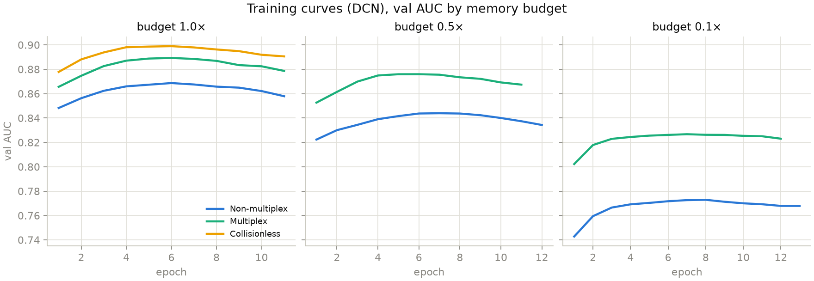

# unified-embeddings

Benchmark comparing three categorical embedding strategies for CTR prediction:

- Non-multiplex: per-feature hash tables, budget split proportional to cardinality
- Multiplex: one shared table, feature-ID salting to separate features
- Collisionless: per-feature tables sized to exact vocabulary (upper bound)

Each is paired with two architectures: a plain MLP and a full-rank DCN-V2
(cross layers + DNN widths follow the paper's per-dataset setup). Expected ordering by AUC: Non-multiplex < Multiplex < Collisionless.

Based on the Feature Multiplexing paper (https://arxiv.org/abs/2305.12102).


## Setup

Python >= 3.10 (tested on 3.12). With [uv](https://docs.astral.sh/uv/):

```
uv venv --python 3.12 .venv
uv pip install --python .venv/bin/python -r requirements.txt
source .venv/bin/activate        # or prefix commands with .venv/bin/python
```

(plain `python -m venv .venv && pip install -r requirements.txt` works too)


## Data setup (one time)

MovieLens-1M — download and unzip:

```
curl -O https://files.grouplens.org/datasets/movielens/ml-1m.zip
unzip ml-1m.zip
```

Avazu and Criteo (paper-faithful path) — download the raw Kaggle files and run
the one-time preparation (vocab pruning to the paper's Tables 4/5, Criteo dense
log-normalization, Avazu hour-of-day; streaming, no full-dataset RAM spike):

```
python prepare_data.py criteo --raw train.txt   # Criteo Display Advertising Challenge
python prepare_data.py avazu  --raw train.gz    # Avazu CTR
```

run.py picks up datasets/*_prepared.parquet automatically (or pass --criteo /
--avazu explicitly). Without prepared files the loaders fall back to HuggingFace
reczoo *_x4 (different preprocessing — do not compare those numbers to the paper).
Per-dataset details: [DATASETS.md](DATASETS.md).


## Running experiments

Results are saved to experiment_logs/ by default (one JSON per dataset + a summary).
Pass --out to change the directory.

### Sampled run (1M random rows from Avazu and Criteo, good for CPU / quick iteration)

```
python run.py --ml1m /path/to/ml-1m --fast
```

### Full run (complete datasets: MovieLens ~1M, Avazu ~36M, Criteo ~45M)

```
python run.py --ml1m /path/to/ml-1m
```

By default only the DCN arm trains (the paper has no MLP arm); pass `--with-mlp`
to add it back. On a GPU server, `run_server.sh` wraps the whole Avazu/Criteo
pipeline (download → prepare → sweep):

```
bash run_server.sh setup      # venv + deps
bash run_server.sh download   # Criteo tarball (Avazu via Kaggle CLI — see script)
bash run_server.sh smoke      # 1M-row sanity check
bash run_server.sh all        # prepare + full Criteo & Avazu sweeps
```

### Single dataset

```
python run.py --ml1m /path/to/ml-1m --skip avazu criteo    # MovieLens only
python run.py --ml1m /path/to/ml-1m --skip movielens criteo # Avazu only
python run.py --ml1m /path/to/ml-1m --skip movielens avazu  # Criteo only
```

### All options

```
--ml-labels wang (default) = Wang et al. 2021 labels (1-2 -> 0, 4-5 -> 1, 3s
            removed; the paper's actual pipeline) | ge3 = rating >= 3 -> 1
--avazu     local Avazu file: raw train.gz/csv or prepared .parquet
--criteo    prepared Criteo .parquet (see prepare_data.py)
--skip      datasets to skip: movielens avazu criteo
--fast      1M sample from Avazu/Criteo (Criteo: head slice, keeps chronology)
--out       output directory, default experiment_logs/
--epochs    max epochs, default 30
--patience  early stopping patience on val AUC, default 5 (0 = no early stop)
--batch     batch size (per-dataset default: movielens 128, avazu/criteo 512)
--lr        learning rate (per-dataset default: movielens 1e-3, others 2e-4)
--cross     number of DCN cross layers (default: paper value per dataset)
--dnn       DNN widths, comma-separated (default: paper value per dataset)
--with-mlp  also train the plain-MLP arm (off by default; DCN only)
--workers   DataLoader workers, default 4 (raise to 8-16 on big servers)
--dropout   dropout in the DNN stack, default 0 (paper has none)
--bn        enable BatchNorm (off by default; costs ~0.5-1 AUC points)
--wd        Adam weight decay, default 1e-5
--runs      independent runs per experiment (paper uses 5), default 1
--seed      base seed, default 42
--paper-protocol  also evaluate test AUC every epoch and report best-over-epochs
--only      run only experiments whose name contains this substring
--budgets   memory budget multipliers for the embedding table, default 1.0.
            e.g. --budgets 1.0 0.5 0.1 runs the sweep matching the paper's
            three table-size columns; collisionless runs once at the max budget
--tb        TensorBoard log dir, default runs/ (pass "" to disable)
--dry-run   print embedding table sizes (rows, MB, share of vocab) and exit
```

### Memory budget sweep (paper Table 1 columns)

The tuned MovieLens config (batch 128, lr 1e-3, no BN/dropout, uniform ±0.05
embedding init, Wang labels) is the default — reproducing the paper's row is:

```
python run.py --ml1m ./ml-1m --skip avazu criteo --budgets 1.0 0.5 0.1
python run.py --ml1m ./ml-1m --skip avazu criteo --budgets 1.0 0.5 0.1 --runs 5   # paper protocol, mean±std
tensorboard --logdir runs
```

TensorBoard logs per experiment: train loss, val AUC, mean L2 norm of embedding
rows (the paper predicts squared norms grow as O(N/M)), and final test AUC.
Result JSONs include per-epoch history and embedding table stats
(rows, size in MB, rows/total_vocab).

## Results — MovieLens-1M (2026-07-13, 5 runs, paper protocol)

Config: batch 128, lr 1e-3, no BatchNorm/dropout, embeddings init uniform(±0.05),
labels per Wang et al. 2021 (ratings 1-2 → 0, 4-5 → 1, 3s removed — the paper's
actual preprocessing pipeline), early stopping patience 5, **5 independent runs
(mean ± std), matching the paper's protocol**:
`--budgets 1.0 0.5 0.1 --runs 5 --only DCN` (the tuned config is the default).
Budgets map to the paper's Table 1 columns: 1.0x = 1.6MB, 0.5x = 791kB, 0.1x = 158kB.

| Budget | Experiment | AUC (5 runs) | Paper | Diff |
|---|---|---|---|---|
| 1.0x | Non-multiplex + DCN | 0.8684 ± 0.0005 | 0.8537 | +0.015 |
| 1.0x | Multiplex + DCN     | 0.8872 ± 0.0002 | 0.8774 | +0.010 |
| 1.0x | Collisionless + DCN | 0.8985 ± 0.0004 | 0.8872 | +0.011 |
| 0.5x | Non-multiplex + DCN | 0.8407 ± 0.0004 | 0.8300 | +0.011 |
| 0.5x | Multiplex + DCN     | 0.8759 ± 0.0007 | 0.8693 | +0.007 |
| 0.1x | Non-multiplex + DCN | 0.7712 ± 0.0008 | 0.7707 | +0.000 |
| 0.1x | Multiplex + DCN     | 0.8263 ± 0.0006 | 0.8200 | +0.006 |

MLP arm (ours, not in the paper; single run 20260712_225032): Non-multiplex
0.8664 / 0.8387 / 0.7682, Multiplex 0.8861 / 0.8751 / 0.8264, Collisionless 0.8963
at 1.0x / 0.5x / 0.1x.

Takeaways:

- Every cell within +1.5 AUC points of the paper, run-to-run std ≤ 0.0008; the
  0.1x Non-multiplex cell matches to the 4th digit (0.7712 vs 0.7707).
- The paper's ordering reproduces at every budget: Non-multiplex < Multiplex < Collisionless.
- The multiplexing gain grows with compression as in the paper:
  +1.9 / +3.5 / +5.5 AUC points at 1.0x / 0.5x / 0.1x (paper: +2.4 / +3.9 / +4.9),
  and it dwarfs the run-to-run noise (std ≤ 0.001).
- Embedding norms scale with compression as the paper's O(N/M) theory predicts
  (squared L2 grows ~2.2x at 0.5x and ~7.4x at 0.1x; theory: 2x and 10x) — see
  emb/l2_mean in TensorBoard.
- Label pitfall: the paper's text says "rating ≥ 3 → 1", but its preprocessing
  reference (Wang et al. 2021, DCN-V2) removes rating-3 examples and binarizes
  1-2 vs 4-5. With the literal "≥ 3" labels every cell lands ≈3 points below the
  paper (`--ml-labels ge3` reproduces that); with Wang labels the numbers match.
  Details per dataset: [DATASETS.md](DATASETS.md).

Regenerate this table for any run: `python report.py experiment_logs/<ts>_movielens.json`.

### Plots

`python plots.py experiment_logs/<ts>_movielens.json` renders three figures into `plots/`:




### Weight orthogonalization (paper Fig. 2, single-layer theory model)

`python orthogonality.py --ml1m ./ml-1m` trains the paper's Sec. 4.2 model
(logistic regression over multiplexed embeddings, all per-feature weights
theta_t initialized in the SAME direction — worst case) across 8 table sizes:


- Orthogonalization confirmed: mean pairwise angle grows from 0° at init to
  53° at M=27K and ~70-72° at M<=1.4K — smaller tables push feature weights
  further apart, as the paper predicts (its Fig. 2 right, Criteo).
- Embedding norms in THIS 10-epoch single-layer setup stay flat (and dip at
  extreme compression) — the O(N/M) norm growth is confirmed in the main DCN
  pipeline instead (squared norms x2.2 at 0.5x, x7.4 at 0.1x, trained to
  convergence with early stopping).

### Training curves in TensorBoard

```
tensorboard --logdir runs        # open http://localhost:6006, SCALARS tab
```

Logged per epoch, one line per experiment: `loss/train`, `auc/val`,
`emb/l2_mean`; `auc/test` (final point); `auc/test_epoch` (only with
`--paper-protocol`).

Layout: `runs/<timestamp>/<dataset>/b<budget>/<method>[_r<run>]/`. Filter runs
with the left-side box (regex), e.g. `b0.1` or `Multiplex\+DCN`.

`plots/*.png` (from `plots.py`) are the static version of the same curves.

## Files

```
DATASETS.md    per-dataset data processing, splits, budget mapping, training notes
prepare_data.py one-time raw Kaggle Avazu/Criteo preprocessing (paper-faithful)
ue.py          embedding modules and prehash helpers
models.py      SimpleMLP and DCNV2
data.py        data loaders for MovieLens, Avazu, Criteo
train.py       training loop with early stopping
benchmark.py   runs 6 experiments for a single dataset
run.py         CLI entry point
report.py      markdown results table with diff vs the paper's Table 1
plots.py       PNG figures from a run JSON (tradeoff, norms, training curves)
orthogonality.py single-layer theory model (paper Sec. 4.2 / Fig. 2): weight
               orthogonalization vs table size
```
